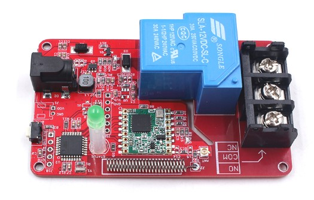
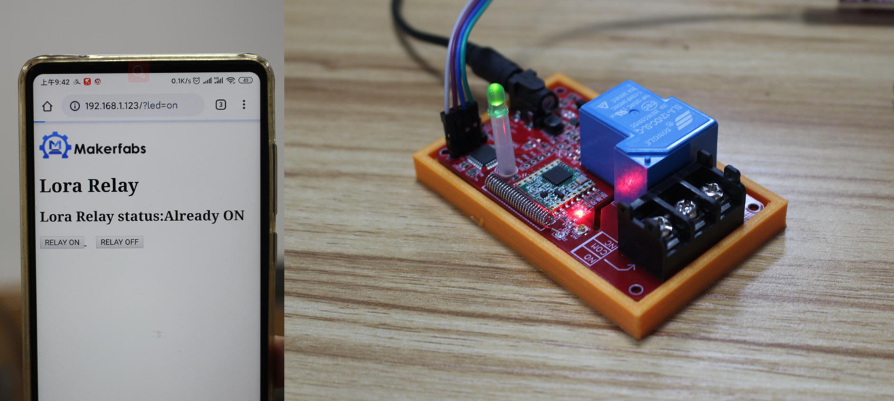
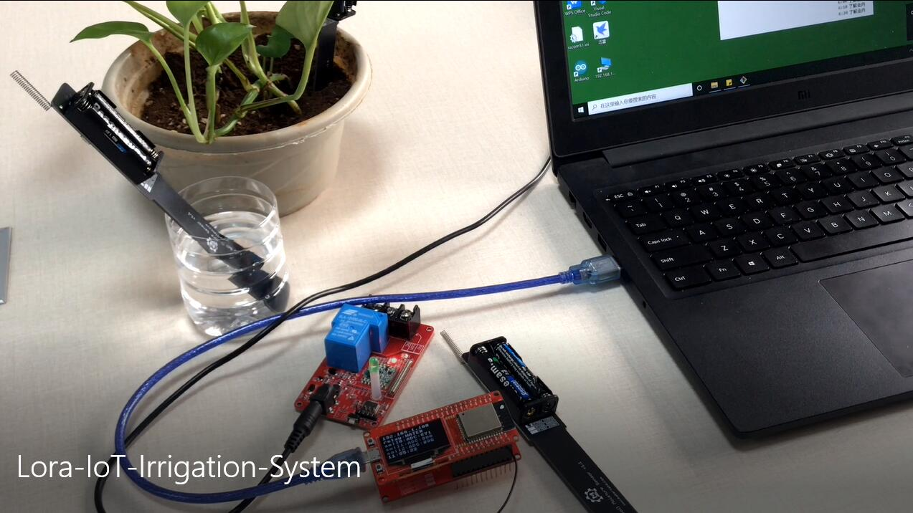

# Lora-Relay

```c++
/*
Version:		V2.0
Author:			UNKOWN
Create Date:	UNKOWN
Note:
	2020/7/23	v2.0: Rebuid readme,add pic. By Vincent
*/
```

[toc]

# Introduce

Lora Relay based on the Arduino, users can program it with Arduino IDE, which is very easy especially suit for the none-programmers. There are also guide for users to learn how to create the first IoT project with this board, with which the starters can learn the hardware and programming skill quickly.



- You can get one from: [Lora-Relay](https://www.makerfabs.com/lora-relay-30a.html)

- Hardware and detailed instructions please visit Wiki page:  [Lora-Relay Wiki](https://wiki.makerfabs.com/Lora_Relay.html)

# Related Projects

## [Project_Lora-Relay-Wifi](https://github.com/Makerfabs/Project_Lora-Relay-Wifi)

- Control relay through wifi.

- [YOUTUBE:Lora relay](https://youtu.be/7O8pRCf0avk)



## [Lora IoT Irrigation System](https://github.com/Makerfabs/Project_IoT-Irrigation-System)

- IoT agricultural irrigation experiment based on Lora communication.
- [YOUTUBE:Lora IoT Irrigation System - Outdoor Simulation Test](https://youtu.be/0mY6Ox0YvRk)


